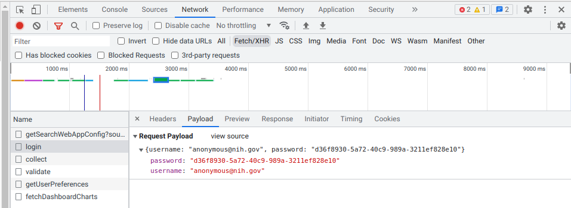

# iqs\_data

## Dependencies
* Python 3
* MySQL
* Elasticsearch
* Logstash
* JDBC

## Run
Run the following commands in order:
1. `python3 01_download_csv_files.py`
2. `python3 02_create_mysql_table.py`
3. `python3 03_create_elasticsearch_index.py`

## Config
Edit variables in `config.py`. Important variables are:
1. `NIH_USERNAME` and `NIH_PASSWORD`: see the below section
2. `MYSQL_TABLENAME`: set this to the name of the MySQL table storing the article data
3. `MYSQL_CHARSET` and `MYSQL_COLLATE`: change these if you get encoding errors or charset/collate not found, different versions of MySQL may have different charset/collate
4. `ELASTICSEARCH_INDEXNAME`: set this to the name of the Elasticsearch index storing the article data
5. `JDBC_DRIVER_LIBRARY`: set this to the correct path of the jdbc jar file on the system
6. `LOGSTASH_BINNAME`: set this to the correct path of the logstash run file on the system
7. `PUBDATE_RANGES`: include publication date ranges you want to download; don't make the range too large (> 1 month) or the server may fail to create a csv file

## Find `NIH_USERNAME` and `NIH_PASSWORD`
The default values for these two variables work upto December 2022. In case NIH changes the anonymous username and password, use the following steps to find them:
1. In your browser, open the developer tools (`ctrl + shift + I` for Google Chromes).
2. Enter the Network tab.
3. Enter this url: `https://icite.od.nih.gov/covid19/search/`.
4. Check the login request. You can see the values for `NIH_USERNAME` and `NIH_PASSWORD` in the Payload tab.

